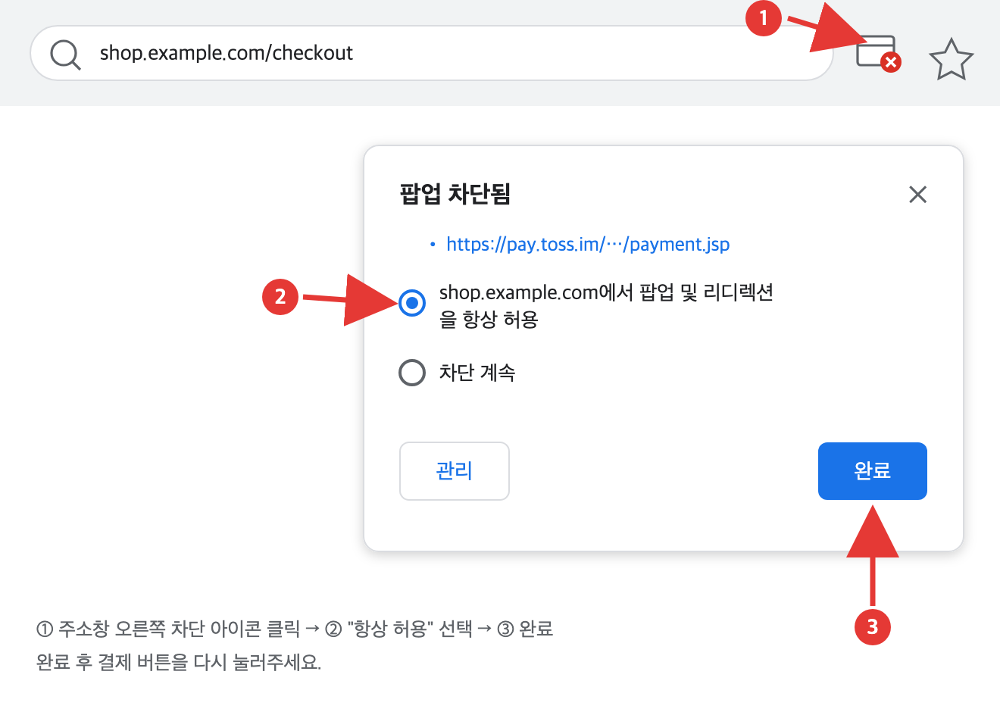
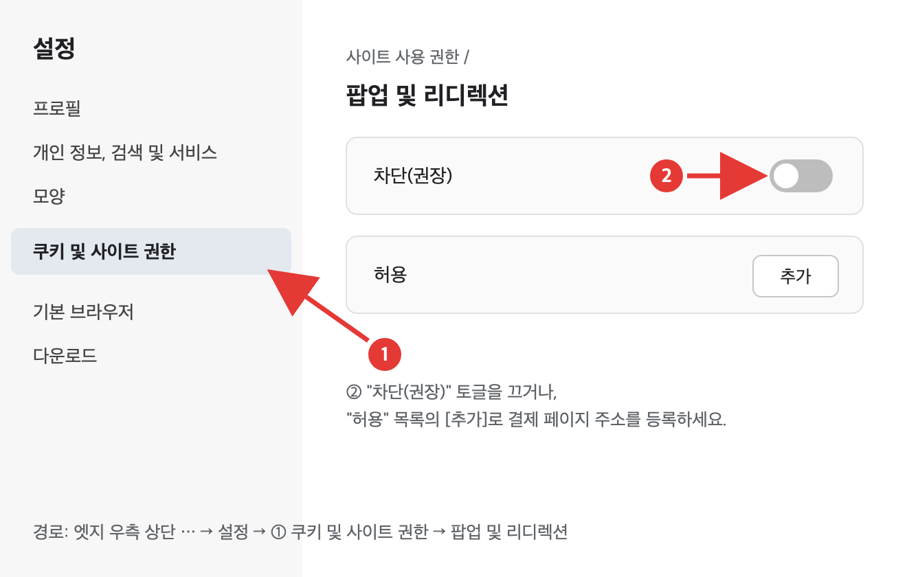
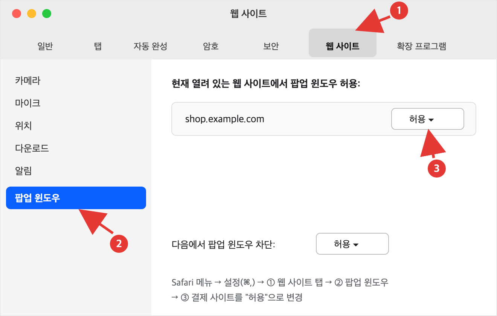
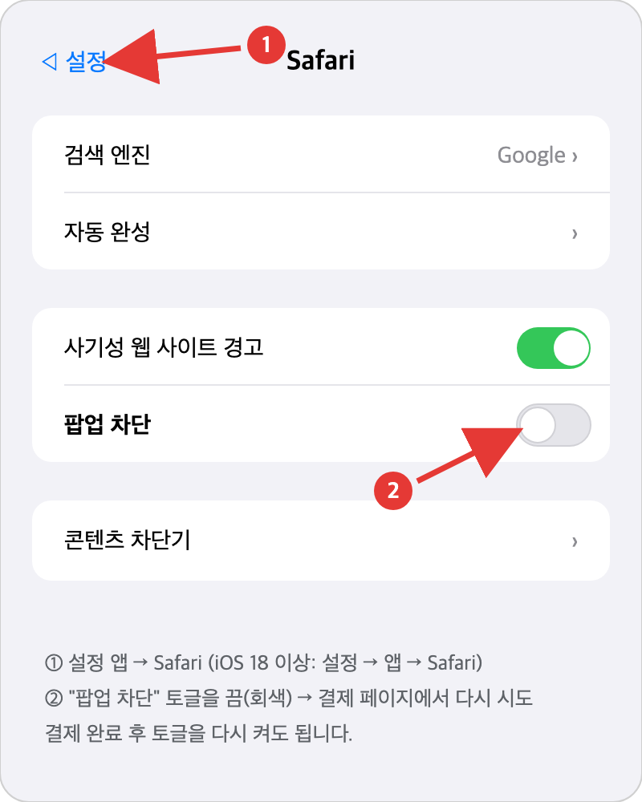
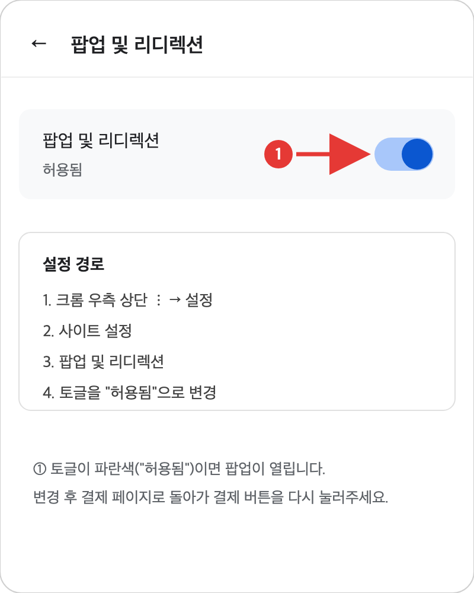
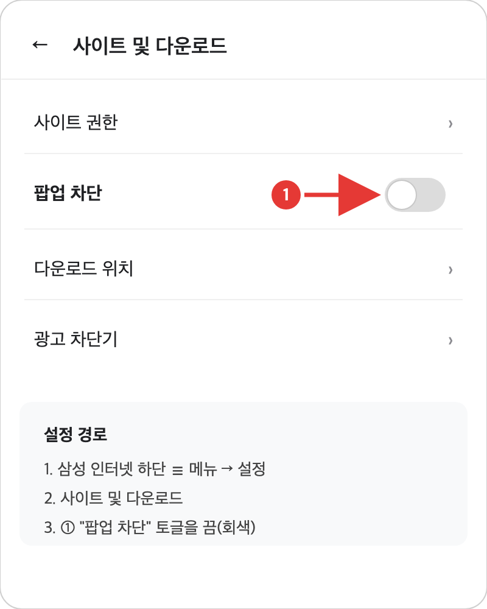
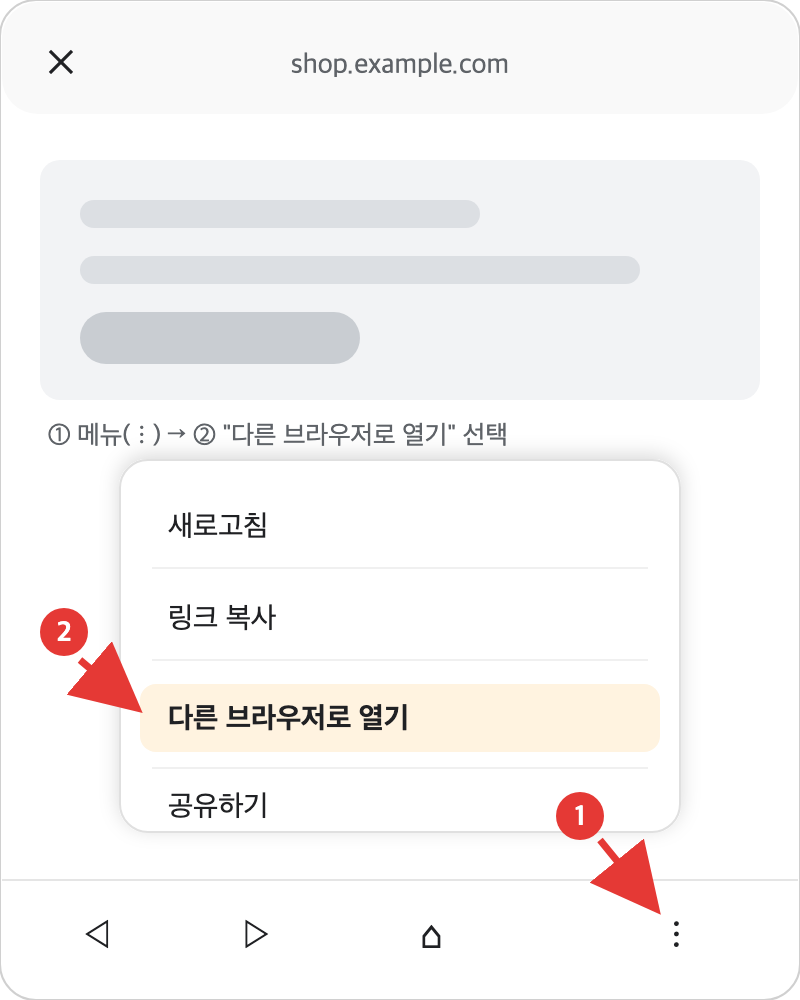

# 결제 팝업이 안 열릴 때 (브라우저 팝업 차단 해제)

토스페이먼츠 결제는 **결제창이 팝업(새 창)으로 열리는 방식**입니다. 구매자의 브라우저가 팝업을 차단하고 있으면 결제 버튼을 눌러도 아무 반응이 없거나, 결제창이 열리지 않아 결제가 진행되지 않습니다.

이 문서는 브라우저별 팝업 차단 해제 방법을 정리한 안내문입니다. **구매자에게 링크 그대로 전달하거나, 필요한 부분을 복사해 안내 문자·카카오톡으로 보내셔도 됩니다.**

---

## 가장 빠른 해결법 (모든 PC 브라우저 공통)

결제 버튼을 누른 직후, **주소창 오른쪽 끝을 확인**하세요.

1. 주소창 오른쪽에 **팝업 차단 아이콘**(창에 ✕ 표시)이 나타납니다.
2. 아이콘을 클릭 → **"팝업 항상 허용"**(또는 "허용")을 선택합니다.
3. 결제 버튼을 **다시** 누르면 결제창이 열립니다.

> 💡 허용을 눌러도 이미 차단된 팝업이 다시 열리지는 않습니다. 반드시 **결제 버튼을 한 번 더** 눌러야 합니다.
>
> 아래 이미지들은 이해를 돕기 위한 **예시 화면(일러스트)**으로, 브라우저 버전에 따라 실제 화면과 다소 다를 수 있습니다.

---

## PC 브라우저별 설정 방법

### Chrome (크롬)

1. 우측 상단 **⋮ (더보기)** → **설정**
2. **개인 정보 보호 및 보안** → **사이트 설정** → **팝업 및 리디렉션**
3. **"사이트에서 팝업을 전송하고 리디렉션을 사용할 수 있음"** 선택
   - 또는 "팝업 전송이 허용됨" 목록에 **결제 페이지 주소를 추가**

주소창에 `chrome://settings/content/popups` 를 입력하면 바로 이동합니다.

### Microsoft Edge (엣지)

1. 우측 상단 **… (설정 등)** → **설정**
2. **쿠키 및 사이트 권한** → **팝업 및 리디렉션**
3. **차단** 토글을 끄거나, **허용** 목록에 결제 페이지 주소를 추가

### Safari (맥)

1. 메뉴 막대 **Safari** → **설정**(⌘,) → **웹 사이트** 탭
2. 왼쪽 목록에서 **팝업 윈도우** 선택
3. 결제 페이지 사이트를 **허용**으로 변경 (기본값을 "허용"으로 바꿔도 됩니다)

### 네이버 웨일 (Whale)

1. 우측 상단 **☰ 메뉴** → **설정**
2. **개인정보 보호** → **사이트 설정**(콘텐츠 설정) → **팝업 차단 및 리디렉션**
3. 허용으로 변경하거나, 허용 목록에 결제 페이지 주소를 추가

---

## 모바일 브라우저별 설정 방법

### iPhone / iPad — Safari

1. **설정 앱** 실행
2. **Safari** 선택 (iOS 18 이상은 **설정 → 앱 → Safari**)
3. **팝업 차단** 토글을 **끔**
4. 결제 페이지로 돌아가 결제 버튼을 다시 누릅니다.

결제 완료 후에는 토글을 다시 켜도 됩니다.

### Android — Chrome (크롬)

1. 크롬 우측 상단 **⋮** → **설정**
2. **사이트 설정** → **팝업 및 리디렉션**
3. 토글을 **허용**으로 변경

### Android — 삼성 인터넷

1. 하단 **☰ 메뉴** → **설정**
2. **사이트 및 다운로드**
3. **팝업 차단** 토글을 **끔**

---

## 카카오톡·인스타그램 등 앱 안에서 열었을 때 (인앱 브라우저)

카카오톡, 인스타그램, 밴드 등 **앱 내부 브라우저**는 팝업 설정을 바꿀 수 없는 경우가 많습니다. 이때는 **기본 브라우저로 다시 여는 것**이 가장 확실합니다.

- **카카오톡**: 페이지 우측 하단(또는 우측 상단) **⋮ / 공유 아이콘** → **"다른 브라우저로 열기"**
- **인스타그램**: 우측 상단 **⋮** → **"외부 브라우저에서 열기"**
- 메뉴가 없으면 **링크 주소를 복사**해서 Safari·크롬에 직접 붙여넣어 여세요.

> 💡 결제 링크를 문자·카카오톡으로 보내는 판매자라면, 링크와 함께 "결제창이 안 열리면 '다른 브라우저로 열기'를 눌러주세요" 한 줄을 같이 보내는 것을 권장합니다.

---

## 그래도 결제창이 안 열린다면

1. **광고 차단 확장 프로그램**(AdBlock, uBlock 등)을 결제 페이지에서 일시 해제해 보세요. 팝업 차단과 별개로 결제창을 막는 경우가 있습니다.
2. **시크릿 모드**가 아닌 일반 창에서 시도해 보세요.
3. 브라우저를 **최신 버전으로 업데이트**한 뒤 다시 시도해 보세요.
4. 다른 브라우저(크롬 ↔ 엣지 ↔ Safari)로 바꿔서 시도해 보세요.

위 방법으로도 해결되지 않으면 결제 페이지 운영자(판매자)에게 사용 중인 **기기·브라우저 종류**와 함께 문의해 주세요.

---

## 판매자용: 구매자에게 보낼 안내 문구 예시

아래 문구를 복사해서 그대로 사용하셔도 됩니다.

> 결제 버튼을 눌러도 결제창이 열리지 않는다면 브라우저의 팝업 차단 때문일 수 있습니다.
>
> - **PC**: 주소창 오른쪽의 팝업 차단 아이콘을 눌러 "항상 허용"을 선택한 뒤, 결제 버튼을 다시 눌러주세요.
> - **아이폰**: 설정 앱 → Safari → "팝업 차단"을 끈 뒤 다시 시도해 주세요.
> - **안드로이드**: 크롬 ⋮ → 설정 → 사이트 설정 → 팝업 및 리디렉션을 허용으로 바꿔주세요.
> - **카카오톡에서 열었다면**: 화면 메뉴에서 "다른 브라우저로 열기"를 눌러주세요.
>
> 자세한 브라우저별 방법은 이 안내 페이지를 참고해 주세요: (이 문서 링크)

---

*본 안내는 2026년 8월 기준 각 브라우저의 메뉴 구성을 반영했습니다. 브라우저 업데이트에 따라 메뉴 이름·위치가 다소 달라질 수 있습니다.*
